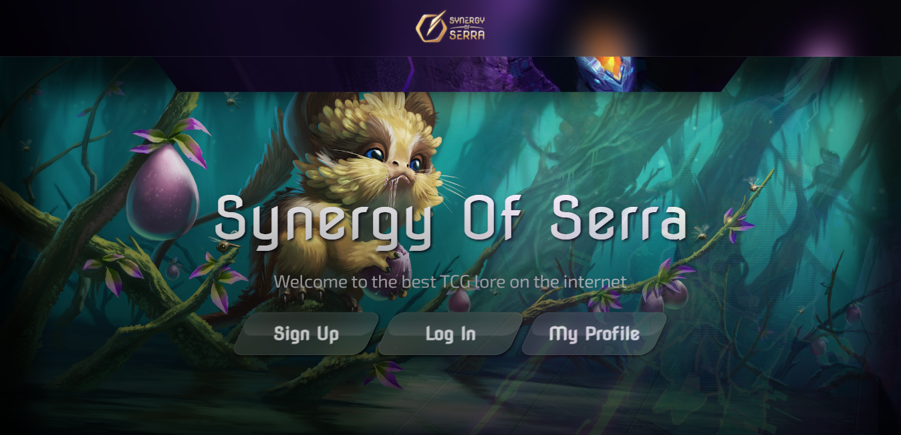
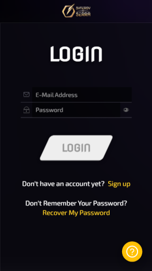
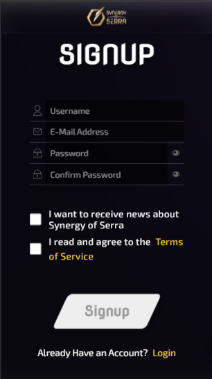
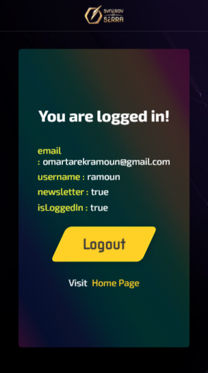

# Synergy Of Serra

> A "FAN-MADE" Prototype for the Signup & Login of the new outstanding NFT TCG **"Synergy Of Serra"**. You can visit the original website on [this link](https://synergyofserra.com/) (thank me later).

## A Screenshot of the Homepage

## Collective Screenshots of the Mobile Version

  
  
  
  

## A Demo for the App

- [Demo](https://serra.omarramoun.com/)

## Built With

- Languages: _**HTML5/Semantics, CSS3/SASS, JS/ES6**_
- Framework: _**React, Redux, Styled-Components, React-Router**_
- Technologies used: _**GIT, GITHUB, LINTERS**_

## Project Life Cycle

0. tools and dependencies
1. UI Architecture
2. Component structure & organization
3. Logic & state management
4. Style + (Responsive)
5. Accessibility
6. Testing
7. Documentation
8. Deployment

## Authors

👤 **Ramoun**

- **GitHub**: 
- **Twitter**: 
- **LinkdIn**: 

## 🤝 Contributing

Contributions, issues, and feature requests are welcome!

Feel free to check the [issues page](../../issues).

## Show your support

Give a ⭐️ if you like this project!

## Acknowledgments

- The team behind Synergey Of Serra (Great Guys)
- My Passion For Computers & TCG
- [M3O](http://m3o.com/) for their great API.

## Special Thanks to Julian

Really thank you for this great game
